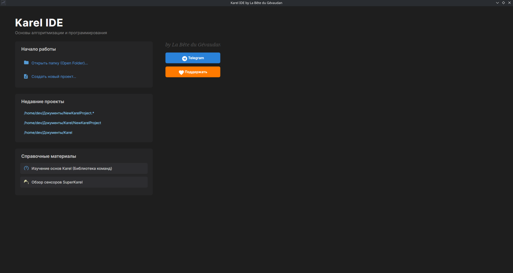
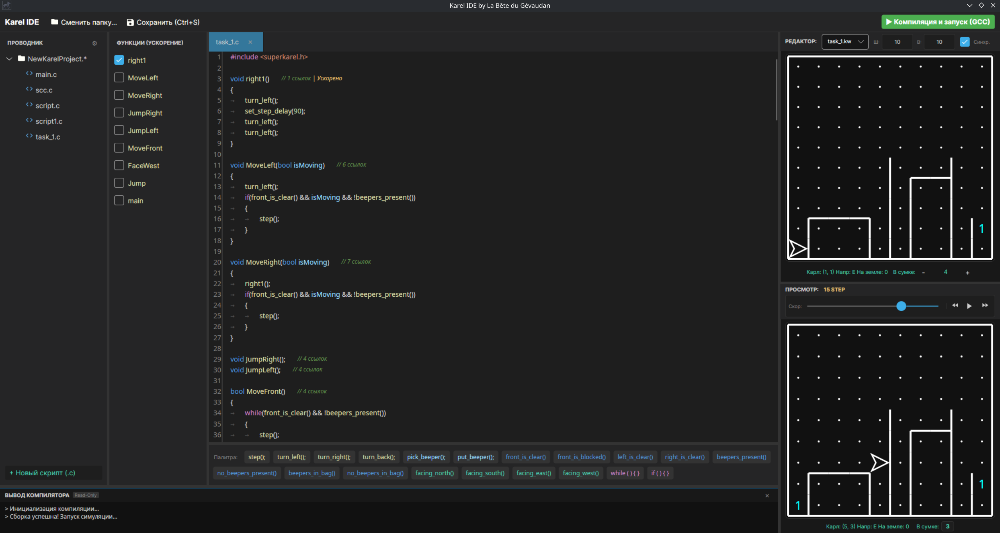

# Karel IDE 🤖

**Karel IDE** — это современная кроссплатформенная среда разработки и интерактивный симулятор для обучения программированию на языке C с использованием библиотеки Робота Карла (*Karel the Robot*).

Приложение включает полностью автономный тулчейн компилятора GCC, текстовый редактор с навигацией по функциям, палитру быстрого ввода команд и графическое поле для отладки алгоритмов в реальном времени.

---

## 🖼️ Интерфейс приложения

### Главное меню и справочник


### Рабочее пространство и симулятор


---

## ✨ Ключевые возможности

- 🚀 **Всё в одном (Portable):** Поставляется с готовым портативным компилятором GCC и библиотекой `karel-the-robot`. Установка системного C/C++ окружения не требуется.
- 🐧🪟 **Кроссплатформенность:** Полноценная поддержка Windows (x64) и Linux (x64).
- 🎮 **Интерактивная симуляция:** Пошаговое выполнение программы, регулировка скорости, отображение состояния сумки, координат и направления Карла.
- 🧩 **Палитра команд:** Быстрый встав базовых функций и условий (`step()`, `turn_left()`, `front_is_clear()`, `beepers_present()` и др.) в один клик.
- ⚡ **Дерево функций:** Быстрая навигация по объявленным функциям C-файла.
- 📖 **Встроенные справочники:** Интерактивные обучающие материалы по основам языка Karel и работе сенсоров SuperKarel прямо на стартовом экране.
- 🗺️ **Редактор карт:** Поддержка загрузки и настройки лабиринтов и миров (`.kw`).

---

## 📥 Скачать и запустить (Releases)

Готовые сборки доступно скачать на странице [**Releases (LTS)**](../../releases/tag/LTS).

### 🪟 Windows (x64)
1. Скачайте архив **`KarelIDE-Windows-x64.zip`**.
2. Распакуйте архив в любую удобную папку.
3. Запустите файл `KarelIDE.App.exe`.

### 🐧 Linux (x64)
1. Скачайте архив **`Linux-build.zip`**.
2. Распакуйте архив:
   ```bash
   unzip Linux-build.zip -d KarelIDE
   cd KarelIDE
   chmod +x KarelIDE.App
   ./KarelIDE.App
   ```
   
